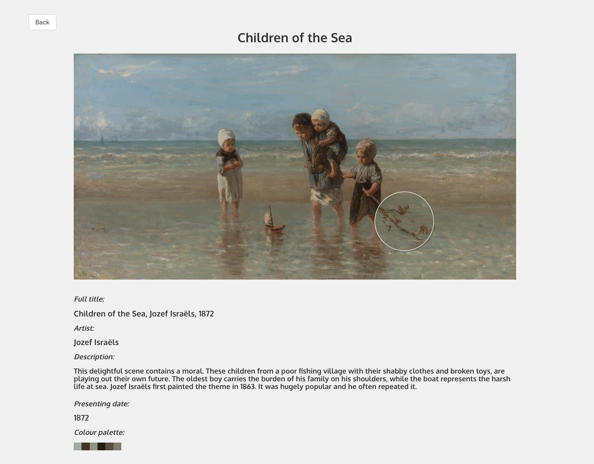
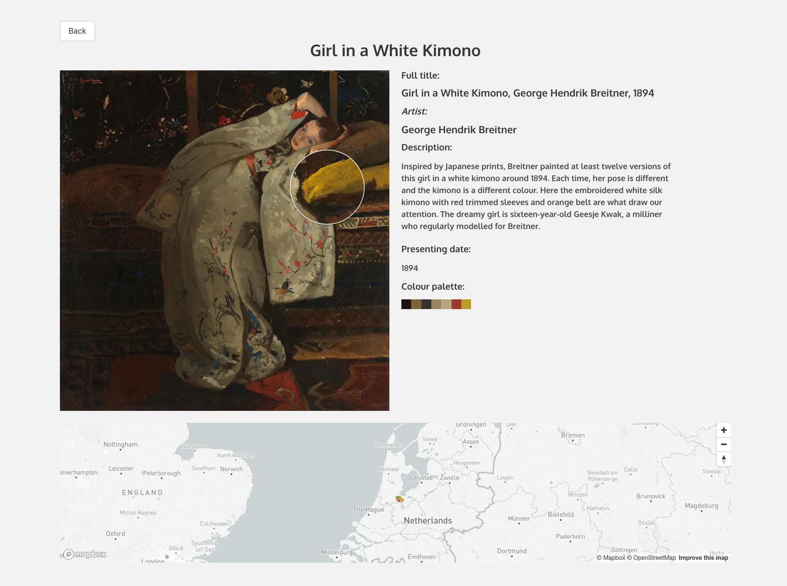

#  Project 2: Art Journey

This is a website on which you can search for art, using any keyword you like (such as "blue", "beach" or "Rembrandt"). The time frame of this pair programming project was 48 hours.

## Built with
* React
* Sass
* Axios
* Bulma
* Express
* Node.js
* Git
* GitHub

## Deployment
The website is deployed on Heroku and can be found [here](https://your-art-journey.herokuapp.com/).

## Getting started
Clone or download the repo. Run 'npm i' from the root directory to download all of the needed packages and then type 'npm run start'. The project will run on localhost:8000.

## Website architecture
The website consists of a home page, which is also the index page, with a search bar and two different pages to show the individual art works. 

### 1. Home/Index page


The home page consists of the name of the website and a search bar. The user can use a wide range of keywords, from colours to objects and places. When a user has searched for something, the data is pulled using the Rijksmuseum API. The search results appear after half of the images have loaded, showing a spinner before this has happened. Below is the function which counts the loaded images:

```javascript
  handleOnLoad = () => {
    this.setState({
      imageCounter: this.state.imageCounter + 1
    })
    if (this.state.artPieces.length === 1) {
      this.setState({ loaded: true })
    } else if (this.state.imageCounter === this.state.artPieces.length / 2) {
      this.setState({ loaded: true })
    }
  }
```


### 2. Show pages

 

The website has two different show pages, depending on the art works. If it's a horizontal work, the image will be displayed with the details underneath it. Otherwise, the image is placed next to the details. When hovering the mouse over the artwork, those parts are magnified. When known, there is also a map on this page showing where the art piece has been made. We used the third-party API Mapbox for this map and marker.

## Wins and challenges
* It was really great to be able to work together with someone on this project. Being able to discuss challenges made it a lot easier to solve bugs. It was also inspirational to see how someone else solves problems and to exchange ideas with them.

* One of the challenges, which turned into  a win when we solved it, was caused by the high resolution of the images of the artworks. Because of this high resolution, it takes a while to download them. This was especially problematic on the results page as it took too much time before every work had been downloaded. This has been solved by compressing the images when pulling them for the result page, setting their size in the get request. The spinner also helps with this problem as it shows that something is happening and only disappears when half of the images have been downloaded.

## Future improvements
* This website uses the Rijksmuseum API, which is a Dutch museum. As a consequence, some of the titles are in Dutch instead of English. In the future, it would be a good idea to add a translation API and translate the titles before showing them on the page. 

* This project had to be made within 48 hours, so there wasn't enough time to make the website fully responsive and functional on all devices. For example, the magnifying glass makes it harder to scroll on a phone. I would like to improve the experience of users who are on a mobile device.